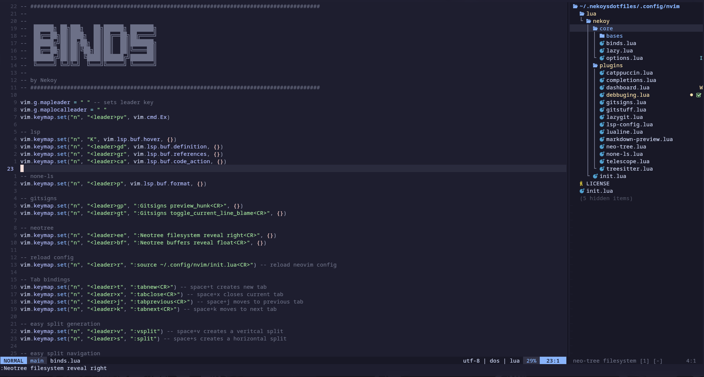

<h1 align="center">Nekoys Nvim Config</h1>

## Preview



## Instalation

#### Make a backup of your current nvim folder

```bash
mv ~/.config/nvim ~/.config/nvim.bak
```

#### Clone the repository

```bash
git clone https://github.com/1Nekoy2/nvim.git ~/.config/nvim
```
## Uninstaling 

```bash
rm -r ~/.config/nvim
```
